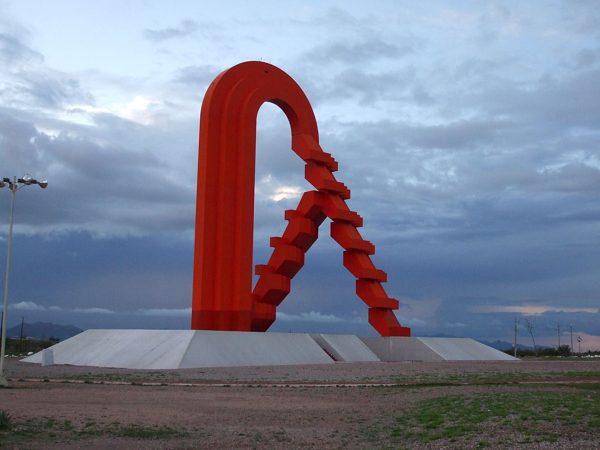
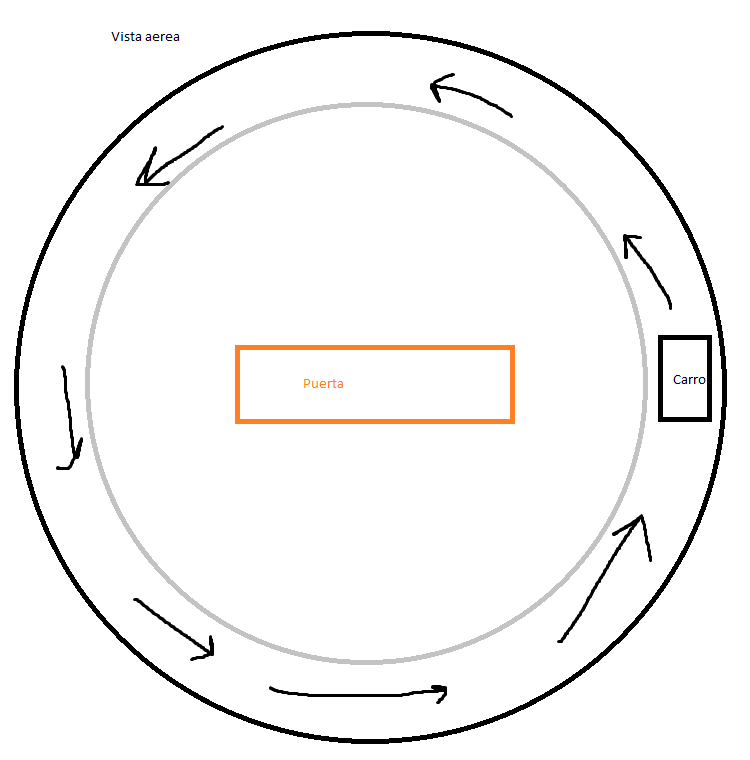

# Proyecto Final
## Idea
Se creará un diorama de la escultura la Puerta de Chihuahua de Enrique Carbajal. Se escogío esta pieza porque está compuesta de formas geométricas que serían divertidas de modelar.

El elemento animado será un carro simple que rodeará la escultura dando vueltas en la glorieta.

## Tecnologias
Se realizará en WebGL usando ThreeJS. Se usará el template de ThreeJS usando Webpack encontrado en [threejs-journey.com](https://threejs-journey.com/lessons/webpack).

## Como correr
Con Node y Webpack instalado, se debe hacer ``npm run dev``